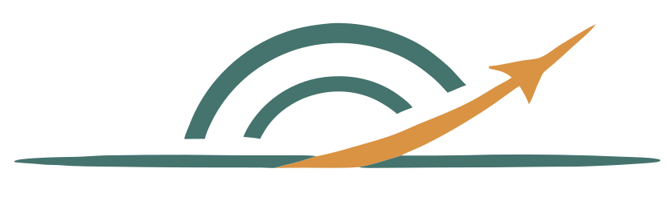

# Mach Mind Team

  <picture>
    
  </picture>
  Collective intelligence at Mach speed

# About us

[Mindaugas](https://www.linkedin.com/in/mindaugas-jonauskis-11931145/) & [Hauke](https://www.linkedin.com/in/hauke-renk-90832739a/) — passionate engineers building autonomous swarm systems in our spare time, from idea to field deployment. Open to unusual projects and collaborations.

📫 [info@machmind.dev](info@machmind.dev)

🌐 [machmind.dev](https://machmind.dev)

# Latest achievements

🏆 **4th place** · Swarm Drone Challenge 2026 Finals · ILA Berlin, June 2026

# Projects

- [drone-swarm-challenge-2026](https://github.com/machmind-dev/drone-swarm-challenge-2026) — Source code for our Swarm Drone Challenge 2026 entry (ESP32-S3/P4, PX4, ArUco, MAVLink)
- [swarm-drone-kit](https://github.com/machmind-dev/swarm-drone-kit) — Next-generation swarm stack built on SDC26 lessons (in progress)
